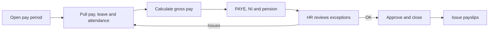
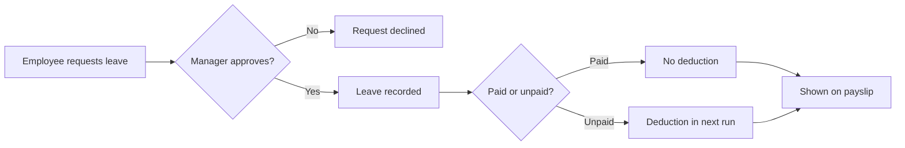

# UK Payroll Platform: Functional Requirements Document

Portfolio version · Prepared by Basava Sanketh B N (Business Analyst) · Logic Lumin Software

Builds on the [BRD](BRD.md). Every functional requirement here points back to a business requirement (BR) there.

> This is a rewritten sample for my portfolio. It follows the structure I used on the project and standard UK payroll rules. The stories, rules and test cases below are examples, not the client's actual backlog.

---

## 1. Users

| Role | What they do in the system |
| --- | --- |
| HR / payroll admin | Sets up employees, records leave, runs and approves payroll, handles corrections |
| Employee | Requests leave, receives payslips |
| Manager | Approves leave for their team |
| Development team | Builds against the stories and acceptance criteria |

## 2. Process flows

### 2.1 Payroll run

### 2.2 Leave to pay

## 3. Functional requirements

Priority is MoSCoW: M (Must), S (Should), C (Could).

### 3.1 Employee pay setup

| ID | Requirement | Priority | BR |
| --- | --- | --- | --- |
| FR-01 | HR can record each employee's salary or hourly rate, pay frequency, start date and leaving date. | M | BR-01 |
| FR-02 | HR can record each employee's tax code, including whether it is on a Week 1/Month 1 basis. | M | BR-01 |
| FR-03 | HR can record each employee's NI category letter. | M | BR-01 |
| FR-04 | Changes to pay details keep a history showing who changed what and when. | M | BR-01, BR-08 |

### 3.2 Leave and attendance

| ID | Requirement | Priority | BR |
| --- | --- | --- | --- |
| FR-05 | Employees can request leave and managers can approve or decline it. | M | BR-05 |
| FR-06 | Each leave type is set up as paid or unpaid. | M | BR-05 |
| FR-07 | Approved unpaid leave and missing attendance reduce gross pay in the next payroll run. | M | BR-05 |
| FR-08 | Leave taken appears on the employee's payslip for that period. | S | BR-05, BR-07 |

### 3.3 Pay calculation

| ID | Requirement | Priority | BR |
| --- | --- | --- | --- |
| FR-09 | The system calculates gross pay for the period, pro-rating for employees who start or leave mid-period. | M | BR-02 |
| FR-10 | The system calculates PAYE from the tax code, on a cumulative or Week 1/Month 1 basis as recorded. | M | BR-03 |
| FR-11 | The system calculates employee and employer National Insurance from the NI category letter. | M | BR-03 |
| FR-12 | Tax, NI and pension thresholds and rates are held as settings for each tax year, not hard-coded. | M | BR-03, BR-04 |

### 3.4 Pension auto-enrolment

| ID | Requirement | Priority | BR |
| --- | --- | --- | --- |
| FR-13 | Each pay period, the system checks every employee's age and earnings against the auto-enrolment criteria. | M | BR-04 |
| FR-14 | Eligible employees are enrolled automatically and contributions are deducted from the next run. | M | BR-04 |
| FR-15 | If an employee opts out within one month of enrolment, their contributions are refunded in the next run. | M | BR-04 |
| FR-16 | Opted-out employees are flagged for re-assessment every three years. | S | BR-04 |

### 3.5 Payroll run and approval

| ID | Requirement | Priority | BR |
| --- | --- | --- | --- |
| FR-17 | HR can open a pay period and start a payroll run. | M | BR-06 |
| FR-18 | Before approval, HR sees totals per deduction type and a list of exceptions (such as missing tax codes or negative net pay). | S | BR-06, BR-09 |
| FR-19 | Only HR can approve a run. Once approved, the period is closed and can't be edited directly. | M | BR-06 |
| FR-20 | Corrections to a closed period are made as adjustments in a later run, with a reason recorded. | M | BR-08 |

### 3.6 Payslips

| ID | Requirement | Priority | BR |
| --- | --- | --- | --- |
| FR-21 | Every employee in an approved run gets a payslip showing gross pay, each deduction and net pay. | M | BR-07 |
| FR-22 | Where pay depends on hours worked, the payslip shows the hours. | M | BR-07 |
| FR-23 | Employees can view and download their past payslips. | C | BR-10 |

## 4. Business rules

| ID | Rule |
| --- | --- |
| BRL-01 | A pay period must be approved before payslips are issued. |
| BRL-02 | A closed pay period is never edited. Any change goes through as an adjustment in a later run. |
| BRL-03 | If an employee has no tax code recorded, the run flags them as an exception and HR must resolve it before approval. |
| BRL-04 | Unpaid leave is deducted in the run that covers the dates it was taken. |
| BRL-05 | Auto-enrolment is checked every pay period, not once a year. |
| BRL-06 | Rates and thresholds for a new tax year apply from the first pay period on or after 6 April. |

## 5. Sample user stories

The real backlog had 32 stories. These are representative examples written for this portfolio.

| ID | Story | FR |
| --- | --- | --- |
| US-01 | As an HR admin, I want to record an employee's tax code so their PAYE is calculated correctly. | FR-02, FR-10 |
| US-02 | As an HR admin, I want starters and leavers paid pro-rata so nobody is over or underpaid in their first or last month. | FR-09 |
| US-03 | As an employee, I want to request leave online so I don't have to email HR. | FR-05 |
| US-04 | As an HR admin, I want unpaid leave deducted automatically so I don't have to adjust pay by hand. | FR-07 |
| US-05 | As an HR admin, I want eligible staff enrolled into the pension automatically so we stay compliant. | FR-13, FR-14 |
| US-06 | As an HR admin, I want to see exceptions before approving a run so errors don't reach payslips. | FR-18 |
| US-07 | As an HR admin, I want corrections made as adjustments so the history of a closed period stays intact. | FR-20 |
| US-08 | As an employee, I want an itemised payslip so I can see exactly how my pay was worked out. | FR-21, FR-22 |

### Acceptance criteria examples

**US-02: Pro-rata pay for a starter**

- Given a monthly-paid employee starts partway through the month, when the payroll run is calculated, then their gross pay covers only the days from their start date.
- Given the same employee, when HR opens the run summary, then the pro-rata adjustment is visible.

**US-05: Pension auto-enrolment**

- Given an employee who meets the age and earnings criteria and is not already a member, when the payroll run is calculated, then they are enrolled and contributions are deducted.
- Given an employee who does not meet the criteria, when the run is calculated, then no contributions are deducted.

**US-07: Correcting a closed period**

- Given a pay period is closed, when HR finds an underpayment in it, then they cannot edit that period.
- Given the same underpayment, when HR adds an adjustment with a reason, then it is paid in the next run and shown on that payslip.

## 6. UAT approach

UAT ran with the client's HR team. Each test case had a worked example with the expected result. Payroll outputs were checked against those results with SQL queries. On the project this came to 45 test cases and 12 defects logged before release.

Sample test cases:

| ID | Scenario | Expected result |
| --- | --- | --- |
| TC-01 | Monthly employee, full month, standard tax code | Gross, PAYE, NI and net pay match the worked example |
| TC-02 | Starter joins mid-month | Gross pay is pro-rated from start date |
| TC-03 | Employee on a Week 1/Month 1 tax code | PAYE is calculated on the current period only |
| TC-04 | Employee takes 2 days unpaid leave | 2 days deducted in the run covering those dates |
| TC-05 | Employee newly meets auto-enrolment criteria | Enrolled and contributions deducted |
| TC-06 | Employee opts out within one month | Contributions refunded in the next run |
| TC-07 | Employee with no tax code | Run shows an exception and blocks approval until fixed |
| TC-08 | Underpayment found after a period is closed | Adjustment paid in the next run with the reason recorded |

## 7. Traceability

| BR | Functional requirements | Sample stories | Sample test cases |
| --- | --- | --- | --- |
| BR-01 Pay setup | FR-01 to FR-04 | US-01 | TC-01, TC-07 |
| BR-02 Gross pay | FR-09 | US-02 | TC-02 |
| BR-03 PAYE and NI | FR-10 to FR-12 | US-01 | TC-01, TC-03 |
| BR-04 Pension | FR-12 to FR-16 | US-05 | TC-05, TC-06 |
| BR-05 Leave to pay | FR-05 to FR-08 | US-03, US-04 | TC-04 |
| BR-06 Approval | FR-17 to FR-19 | US-06 | TC-07 |
| BR-07 Payslips | FR-21, FR-22 | US-08 | TC-01 |
| BR-08 Corrections | FR-04, FR-20 | US-07 | TC-08 |
| BR-09 Run summary | FR-18 | US-06 | TC-07 |
| BR-10 Payslip history | FR-23 | | |
